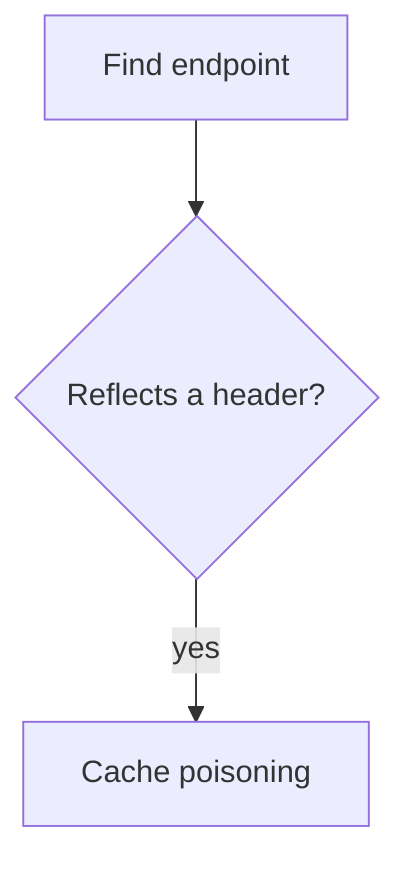

# m1kr0 blog

Bug bounty writeup va metodologiya blogi. Hugo static sayt, tema noldan yozilgan,
`.nfo` scene-release estetikasi. Ikki tema: yorug' (blueprint) va qorong'i (amber CRT).

Dizayn spetsifikatsiyasi: [`docs/superpowers/specs/2026-07-26-nfo-blog-design.md`](docs/superpowers/specs/2026-07-26-nfo-blog-design.md)

## Talablar

Hugo **extended** 0.146 dan yuqori (yangi `layouts/` shabloni tizimi ishlatilgan).
Sinovdan o'tgan versiya: 0.164.0.

```bash
# Arch / CachyOS
sudo pacman -S hugo

# yoki binary sifatida, sudosiz
curl -sL https://github.com/gohugoio/hugo/releases/download/v0.164.0/hugo_extended_0.164.0_linux-amd64.tar.gz \
  | tar -xz -C /tmp hugo && install -m755 /tmp/hugo ~/.local/bin/hugo
```

## Lokal ishga tushirish

```bash
hugo server -D        # -D qoralamalarni ham ko'rsatadi
```

Ochiladi: <http://localhost:1313>

## Yangi post — terminal

Sayt ikki tilli. Ingliz — asosiy til (`content/en/`), o'zbek `/uz/` ostida
(`content/uz/`).

```bash
hugo new content/en/posts/cache-poisoning-to-stored-xss.md
$EDITOR content/en/posts/cache-poisoning-to-stored-xss.md
# draft: false qil, keyin:
git commit -am "post: cache poisoning to stored xss" && git push
```

Frontmatter:

```yaml
---
title: "Cache Poisoning to Stored XSS"
date: 2026-07-26T21:00:00+05:00
tags: ["bug bounty", "writeup"]
translationKey: cache-poisoning-to-stored-xss
draft: false
summary: ""     # bo'sh qoldirsang matnning boshidan olinadi
---
```

**Sana haqida.** Vaqt mintaqasi `hugo.toml` da `Asia/Tashkent` qilib qo'yilgan, shuning
uchun `date: 2026-07-26` kabi yalang'och sana ham to'g'ri o'qiladi. Baribir kelajakdagi
sanani yozsang, Hugo o'sha postni chiqarmaydi — bu xato emas, shunday mo'ljallangan.

Qolgan hamma narsa avtomatik: post raqami, o'qish vaqti, teg sahifalari, RSS, bosh
sahifadagi post soni.

## Ikki til

Har post ikki tilda bo'lishi mumkin, lekin **majburiy emas** — tarjimasi yo'q post
bemalol yashaydi, faqat unda til tugmasi o'chirilgan holatda ko'rinadi.

Ikkovini bog'laydigan narsa — `translationKey`. Fayl nomlari har til uchun tabiiy
bo'lishi mumkin:

```
content/en/posts/cache-poisoning.md      translationKey: cache-poisoning
content/uz/posts/kesh-zaharlanishi.md    translationKey: cache-poisoning
```

Natija: `/posts/cache-poisoning/` va `/uz/posts/kesh-zaharlanishi/`, ikkovi
bir-biriga havola qiladi va **bitta release raqamini** bo'lishadi.

Interfeys so'zlari `i18n/en.toml` va `i18n/uz.toml` da. Yangi matn qo'shsang,
ikkalasiga ham yoz — birida qolib ketsa Hugo kalitning o'zini chiqaradi.

Sarlavha, `focus`, `tagline`, `description` har til uchun `hugo.toml` dagi
`[languages.<til>.params]` da.

## Chizmalar

Ikki sintaksis qo'llab-quvvatlanadi.

**GoAT** — ASCII chizma build paytida SVG'ga aylanadi. JavaScript yo'q, ranglar temaga
ergashadi:

````markdown
```goat
 .-----------.      .------------.
 | attacker  +----->| CDN cache  |
 '-----------'      '------------'
```
````

**Mermaid** — haqiqiy sintaksis, brauzerda chiziladi:

````markdown

````

Mermaid bundle'i (3.4 MB) `assets/js/mermaid.min.js` da lokal saqlanadi va **faqat**
`mermaid` bloki bor sahifada yuklanadi. Boshqa postlar JavaScript'siz qoladi.

To'liq namuna: `content/en/posts/diagram-reference.md` (doimiy qoralama).

## Deploy — Cloudflare Workers (static assets)

1. Repo'ni GitHub'ga push qil (`MuxammadiyevG/blog`)
2. Cloudflare dashboard → Workers & Pages → Create → Connect to Git
3. Sozlamalar:

   | Maydon | Qiymat |
   |---|---|
   | Build command | `hugo --minify` |
   | Deploy command | `npx wrangler deploy` |
   | Environment variable | `HUGO_VERSION` = `0.164.0` |

   Deploy nimani yuborishini `wrangler.jsonc` belgilaydi: `assets.directory = ./public`.

4. Deploy tugagach `hugo.toml` dagi `baseURL` ni haqiqiy manzilga o'zgartir va push qil.
   Bu muhim — RSS va OG teglari shu qiymatdan absolyut URL yasaydi.

Shundan keyin har `main` branch'ga push avtomatik deploy'ni ishga tushiradi. Boshqa hech
narsa bosilmaydi:

```
git push  →  GitHub webhook  →  Cloudflare build (hugo --minify)  →  deploy  (~25s)
```

Pull request ochsang, unga alohida preview manzili beriladi; `main` ga tegmaydi.

## Admin paneli yo'q

Ataylab. Post yozish yo'li bitta: markdown fayl + `git push`.

Bu qaror butun bir xavfsizlik toifasini olib tashlaydi — saytda GitHub tokeni yo'q,
brauzerda saqlanadigan sir yo'q, `/admin` sahifasi yo'q, audit qilinmagan uchinchi tomon
redaktori yo'q, deploy qilinadigan OAuth Worker yo'q.

Agar keyin brauzerdan yozish kerak bo'lsa, ikki yo'l bor edi: Sveltia CMS (fine-grained
PAT bilan, Worker'siz) yoki o'z panelimiz (~10 KB, GitHub Contents API'ga bitta `PUT`).
Ikkalasi ham qaytarib qo'shsa bo'ladi.

## Vendored fayllar

Tashqi so'rov bo'lmasligi uchun hamma narsa repo ichida. Versiya va sha256 —
`docs/vendored.md` da.

| Fayl | Nima |
|---|---|
| `static/fonts/plex-mono-*.woff2` | IBM Plex Mono, OFL |
| `assets/js/mermaid.min.js` | mermaid 11.16.0, faqat chizmali sahifada yuklanadi |

## Xavfsizlik sarlavhalari

`static/_headers` Cloudflare Pages tomonidan o'qiladi va har javobga CSP hamda bir nechta
qattiqlashtiruvchi sarlavha qo'shadi.

| Direktiva | Qiymat | Nega |
|---|---|---|
| `script-src` | `'self'` | Inline skript umuman yo'q, `unsafe-eval` ham yo'q — inyeksiya qilingan payload bajarilmaydi |
| `style-src` | `'self' 'unsafe-inline'` | Mermaid va GoAT SVG ichiga inline uslub yozadi, buni o'zgartirib bo'lmaydi |
| `default-src` | `'none'` | Qolgan hammasi taqiqlangan |
| `frame-ancestors` | `'none'` | Clickjacking |
| `form-action` | `'none'` | Saytda forma yo'q |

O'lchangan natija: oddiy sahifalarda 0 buzilish, chizmali sahifada ham 0 — va chizmali
sahifada `script-src` buzilishi hech qachon bo'lmagan, faqat `style-src` edi.

Skriptlar tashqi fayl bo'lgani uchun har biriga Hugo `integrity` (SRI) hash qo'yadi.

### Postda xom HTML ishlamaydi

`hugo.toml` da `markup.goldmark.renderer.unsafe = false`. Ya'ni markdown ichiga yozilgan
`<script>` yoki `` bajarilmaydi — matn sifatida ko'rinadi.

Bu ataylab: writeup yozganda payload nusxalaysan, ulardan biri kod bloki tashqarisida
qolib ketsa o'z domeningda ishga tushardi. Kod bloki (```` ``` ````) ichidagi hamma narsa
avvalgidek xavfsiz ko'rsatiladi.

Agar postda haqiqatan HTML kerak bo'lsa — shortcode yozamiz, u nazorat ostida bo'ladi.

## Writeup chiqarishdan oldin

Program'ning disclosure siyosatini tekshir. Ko'p program yozma ruxsatsiz nashrni
ta'qiqlaydi, hatto redaktsiya qilingan bo'lsa ham. HackerOne'da odatda
"Request public disclosure" tugmasi bor.

## Moslashtirish

### ASCII art

`assets/ascii/hero.txt` — bosh bannery. `assets/ascii/rule.txt` — ajratgich chiziq.

Ikki o'lcham rejimi, `hugo.toml` dagi `heroArtScale` bilan tanlanadi:

- `block` (hozirgi) — qo'lda chizilgan banner, oddiy o'lchamda
- `image` — surat matnga aylantirilgan katta art, 2.2px da chiziladi

Surat-artga o'tsang `heroArtScale = "image"` qil.

### Ranglar va temalar

Oltita tema: `blueprint` (yorug', ko'k), `amber` (qorong'i, sariq), `neon` (qorong'i,
siyon), `phosphor` (qorong'i, yashil), `paper` (yorug', sepia), `mono` (qorong'i,
rangsiz). Ustiga `auto` — tizim sozlamasiga ergashadi.

Hammasi `assets/css/style.css` boshida, har biri bir xil o'zgaruvchi nomlarini
belgilaydi:

```css
:root, :root[data-theme="blueprint"] { ... }   /* yorug' odatiy */
:root[data-theme="amber"] { ... }
@media (prefers-color-scheme: dark) {
  :root:not([data-theme]) { ... }              /* tanlanmagan bo'lsa: amber */
}
:root[data-theme="neon"] { ... }
```

Yangi tema qo'shish: shu ro'yxatga bitta blok, `layouts/_partials/nav.html` dagi
menyuga bitta tugma, `assets/js/theme-init.js` dagi `THEMES` massiviga nom.

Keyin kontrastni tekshir:

```bash
node docs/contrast-check.js
```

Skript qiymatlarni CSS faylning o'zidan o'qiydi, ya'ni ro'yxat hech qachon koddan
uzoqlashib ketmaydi. Har tema uchun 19 juftlik: asosiy matn, havola, teg, va kod
ranglari. Asosiy matn uchun chegara WCAG AA (4.5:1), bezak elementlari uchun pastroq.

Tanlov `localStorage` da `theme` kaliti ostida saqlanadi. Eski ikki temali versiyadan
qolgan `light` / `blueprint` va `dark` / `amber` qiymatlari avtomatik ko'chiriladi.

### Info bloki

`hugo.toml` dagi global `[params]`: `handle`, `github`, `twitter`, `heroArtScale`.
Tilga bog'liqlari (`releaseName`, `focus`, `tagline`, `description`) —
`[languages.en.params]` va `[languages.uz.params]` da.

## Post raqami

Odatda sanadan hisoblanadi — eng eski post `#0001`. O'rtadagi post o'chirilsa keyingi
raqamlar siljiydi. Raqamni muzlatish kerak bo'lsa frontmatter'ga:

```yaml
id: 7
```

## Nima yo'q

Izoh, analitika, qidiruv, ko'p tillilik, obuna formasi. Ataylab. Kerak bo'lganda
qo'shiladi.
