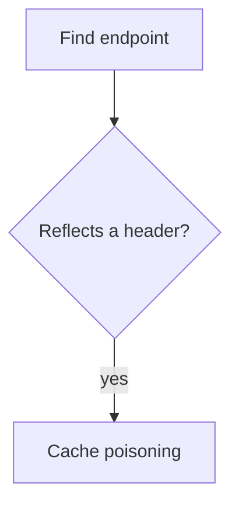

# m1kr0 blog

Bug bounty writeup va metodologiya blogi. Hugo static sayt, tema noldan yozilgan,
`.nfo` scene-release estetikasi. Ikki tema: yorug' (blueprint) va qorong'i (amber CRT).

Dizayn spetsifikatsiyasi: [`docs/superpowers/specs/2026-07-26-nfo-blog-design.md`](docs/superpowers/specs/2026-07-26-nfo-blog-design.md)

## Talablar

Hugo **extended** 0.146 dan yuqori (yangi `layouts/` shabloni tizimi ishlatilgan).
Sinovdan o'tgan versiya: 0.164.0.

```bash
# Arch / CachyOS
sudo pacman -S hugo

# yoki binary sifatida, sudosiz
curl -sL https://github.com/gohugoio/hugo/releases/download/v0.164.0/hugo_extended_0.164.0_linux-amd64.tar.gz \
  | tar -xz -C /tmp hugo && install -m755 /tmp/hugo ~/.local/bin/hugo
```

## Lokal ishga tushirish

```bash
hugo server -D        # -D qoralamalarni ham ko'rsatadi
```

Ochiladi: <http://localhost:1313>

## Yangi post — terminal

Sayt ikki tilli. Ingliz — asosiy til (`content/en/`), o'zbek `/uz/` ostida
(`content/uz/`).

```bash
hugo new content/en/posts/cache-poisoning-to-stored-xss.md
$EDITOR content/en/posts/cache-poisoning-to-stored-xss.md
# draft: false qil, keyin:
git commit -am "post: cache poisoning to stored xss" && git push
```

Frontmatter:

```yaml
---
title: "Cache Poisoning to Stored XSS"
date: 2026-07-26T21:00:00+05:00
tags: ["bug bounty", "writeup"]
translationKey: cache-poisoning-to-stored-xss
draft: false
summary: ""     # bo'sh qoldirsang matnning boshidan olinadi
---
```

**Sana haqida.** Vaqt mintaqasi `hugo.toml` da `Asia/Tashkent` qilib qo'yilgan, shuning
uchun `date: 2026-07-26` kabi yalang'och sana ham to'g'ri o'qiladi. Baribir kelajakdagi
sanani yozsang, Hugo o'sha postni chiqarmaydi — bu xato emas, shunday mo'ljallangan.

Qolgan hamma narsa avtomatik: post raqami, o'qish vaqti, teg sahifalari, RSS, bosh
sahifadagi post soni.

## Ikki til

Har post ikki tilda bo'lishi mumkin, lekin **majburiy emas** — tarjimasi yo'q post
bemalol yashaydi, faqat unda til tugmasi o'chirilgan holatda ko'rinadi.

Ikkovini bog'laydigan narsa — `translationKey`. Fayl nomlari har til uchun tabiiy
bo'lishi mumkin:

```
content/en/posts/cache-poisoning.md      translationKey: cache-poisoning
content/uz/posts/kesh-zaharlanishi.md    translationKey: cache-poisoning
```

Natija: `/posts/cache-poisoning/` va `/uz/posts/kesh-zaharlanishi/`, ikkovi
bir-biriga havola qiladi va **bitta release raqamini** bo'lishadi.

Interfeys so'zlari `i18n/en.toml` va `i18n/uz.toml` da. Yangi matn qo'shsang,
ikkalasiga ham yoz — birida qolib ketsa Hugo kalitning o'zini chiqaradi.

Sarlavha, `focus`, `tagline`, `description` har til uchun `hugo.toml` dagi
`[languages.<til>.params]` da.

## Chizmalar

Ikki sintaksis qo'llab-quvvatlanadi.

**GoAT** — ASCII chizma build paytida SVG'ga aylanadi. JavaScript yo'q, ranglar temaga
ergashadi:

````markdown
```goat
 .-----------.      .------------.
 | attacker  +----->| CDN cache  |
 '-----------'      '------------'
```
````

**Mermaid** — haqiqiy sintaksis, brauzerda chiziladi:

````markdown

````

Mermaid bundle'i (3.4 MB) `assets/js/mermaid.min.js` da lokal saqlanadi va **faqat**
`mermaid` bloki bor sahifada yuklanadi. Boshqa postlar JavaScript'siz qoladi.

To'liq namuna: `content/en/posts/diagram-reference.md` (doimiy qoralama).

## Yangi post — brauzer

`https://<sayt>/admin` — Sveltia CMS. Forma to'ldirasan, `Publish` bosasan, u GitHub
repo'siga xuddi shu `.md` faylni commit qiladi. Ikki yo'l bir xil manbaga yozadi.

Ishlashi uchun avval OAuth sozlanishi kerak, pastga qara.

## Deploy — Cloudflare Pages

1. Repo'ni GitHub'ga push qil (`MuxammadiyevG/blog`)
2. Cloudflare dashboard → Workers & Pages → Create → Pages → Connect to Git
3. Sozlamalar:

   | Maydon | Qiymat |
   |---|---|
   | Build command | `hugo --minify` |
   | Build output directory | `public` |
   | Environment variable | `HUGO_VERSION` = `0.164.0` |

4. Deploy tugagach `hugo.toml` dagi `baseURL` ni haqiqiy manzilga o'zgartir va push qil.
   Bu muhim — RSS va OG teglari shu qiymatdan absolyut URL yasaydi.

## CMS kirishini sozlash

Sveltia CMS GitHub'ga sening nomingdan yozadi. Token almashinuvini Cloudflare Worker
bajaradi.

### 1. GitHub OAuth App

GitHub → Settings → Developer settings → OAuth Apps → New OAuth App

| Maydon | Qiymat |
|---|---|
| Application name | `blog cms` |
| Homepage URL | saytning manzili |
| Authorization callback URL | `https://<worker>.workers.dev/callback` |

`Client ID` va yangi `Client secret` ni ol.

### 2. Worker

```bash
git clone https://github.com/sveltia/sveltia-cms-auth
cd sveltia-cms-auth
npx wrangler deploy
npx wrangler secret put GITHUB_CLIENT_ID
npx wrangler secret put GITHUB_CLIENT_SECRET
npx wrangler secret put ALLOWED_DOMAINS      # saytning domeni
```

O'zgaruvchi nomlari va callback yo'lini o'sha repo'ning README'si bilan solishtir —
versiya bilan o'zgarishi mumkin.

### 3. Ulash

`static/admin/config.yml` dagi `base_url` ni Worker manziliga o'zgartir:

```yaml
base_url: https://sveltia-cms-auth.<sening-subdomening>.workers.dev
```

### Xavfsizlik eslatmalari

- `GITHUB_CLIENT_SECRET` faqat Worker secret'ida turadi. Repo'ga, `config.yml` ga
  tushmasligi kerak.
- Scope `public_repo` — bu **akkauntning barcha ochiq repolariga** yozish huquqi.
  Klassik OAuth App'ni bitta repo bilan cheklab bo'lmaydi. Torroq ruxsat kerak bo'lsa,
  GitHub App'ga o'tish kerak (ko'proq sozlash).
- `/admin` sahifasi ochiq — bu static fayl, yashirib bo'lmaydi. U faqat forma; yozish
  huquqi GitHub OAuth'dan keladi.
- `static/admin/sveltia-cms.js` ataylab lokal saqlangan, CDN'dan yuklanmaydi: bu skript
  GitHub tokenini ushlaydi, demak buzilgan CDN = buzilgan repo. Versiya va sha256
  `static/admin/VERSION.txt` da.
- Mermaid ham lokal (`assets/js/mermaid.min.js`, versiya `VERSION.txt` da) va
  `securityLevel: 'strict'` bilan ishga tushadi — chizma yorlig'i ichidagi HTML
  bajarilmaydi. CMS tokeni shu domenda turgani uchun bu muhim.

## Writeup chiqarishdan oldin

Program'ning disclosure siyosatini tekshir. Ko'p program yozma ruxsatsiz nashrni
ta'qiqlaydi, hatto redaktsiya qilingan bo'lsa ham. HackerOne'da odatda
"Request public disclosure" tugmasi bor.

## Moslashtirish

### ASCII art

`assets/ascii/hero.txt` — bosh bannery. `assets/ascii/rule.txt` — ajratgich chiziq.

Ikki o'lcham rejimi, `hugo.toml` dagi `heroArtScale` bilan tanlanadi:

- `block` (hozirgi) — qo'lda chizilgan banner, oddiy o'lchamda
- `image` — surat matnga aylantirilgan katta art, 2.2px da chiziladi

Surat-artga o'tsang `heroArtScale = "image"` qil.

### Ranglar

Hammasi `assets/css/style.css` boshidagi CSS o'zgaruvchilarida. Uch joyda: `:root`
(yorug'), `:root[data-theme="dark"]`, va `@media (prefers-color-scheme: dark)` bloki.
Qorong'i qiymatlarni o'zgartirsang — oxirgi ikkalasini ham yangila.

Kontrastni tekshirish uchun `docs/contrast-check.js` bor:

```bash
node docs/contrast-check.js
```

Hamma juftlik WCAG AA (4.5:1) dan o'tishi kerak; bezak elementlari uchun 3:1.

### Info bloki

`hugo.toml` dagi global `[params]`: `handle`, `github`, `twitter`, `heroArtScale`.
Tilga bog'liqlari (`releaseName`, `focus`, `tagline`, `description`) —
`[languages.en.params]` va `[languages.uz.params]` da.

## Post raqami

Odatda sanadan hisoblanadi — eng eski post `#0001`. O'rtadagi post o'chirilsa keyingi
raqamlar siljiydi. Raqamni muzlatish kerak bo'lsa frontmatter'ga:

```yaml
id: 7
```

## Nima yo'q

Izoh, analitika, qidiruv, ko'p tillilik, obuna formasi. Ataylab. Kerak bo'lganda
qo'shiladi.
