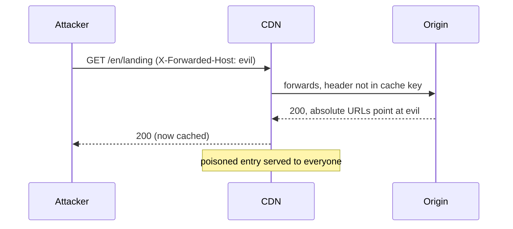
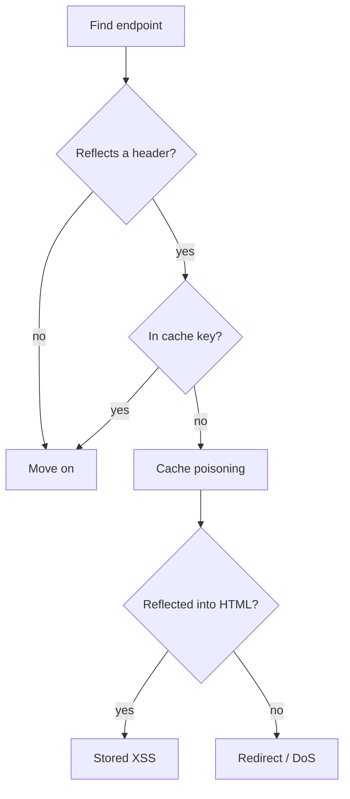

Two ways to draw. Both stay a draft — this post exists so `hugo server -D` shows what each
one looks like.

## GoAT — ASCII, rendered at build

Hugo turns a `goat` fenced block into SVG while building. No JavaScript reaches the
reader, and the drawing inherits the page colours.

````markdown
```goat
 .-----------.      .------------.      .----------.
 | attacker  +----->| CDN cache  +----->|  origin  |
 '-----------'      '-----+------'      '----------'
                          |
                          v
                    .-----------.
                    |  victim   |
                    '-----------'
```
````

Renders as:

```goat
 .-----------.      .------------.      .----------.
 | attacker  +----->| CDN cache  +----->|  origin  |
 '-----------'      '-----+------'      '----------'
                          |
                          v
                    .-----------.
                    |  victim   |
                    '-----------'
```

You place every box yourself. That is the trade: no layout engine, no payload.

## Mermaid — real syntax, drawn in the browser

For anything with branching or ordering, mermaid is worth its weight. The bundle is
3.4 MB (0.9 MB over the wire) and loads **only** on pages that contain a `mermaid` block.

````markdown

````

Renders as:


And a flowchart:



Mermaid runs with `securityLevel: 'strict'`, so HTML written inside a diagram label is not
rendered. Diagrams redraw when the colour theme is toggled.

## Which to use

| Case | Use |
|---|---|
| A short chain: A → B → C | GoAT |
| Anything you would otherwise draw by hand | GoAT |
| Sequence diagrams | mermaid |
| Decision trees, state machines | mermaid |
| A post that must stay JavaScript-free | GoAT |
